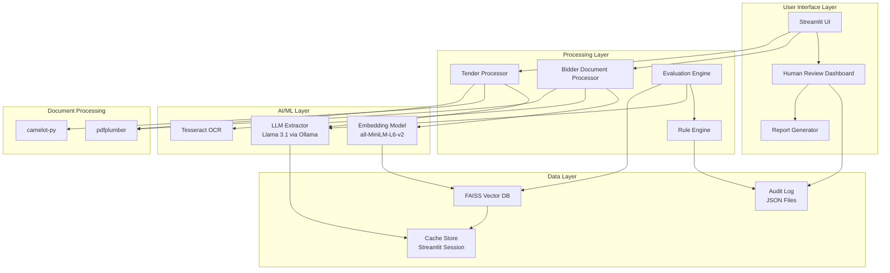
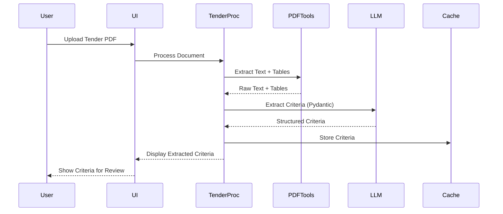
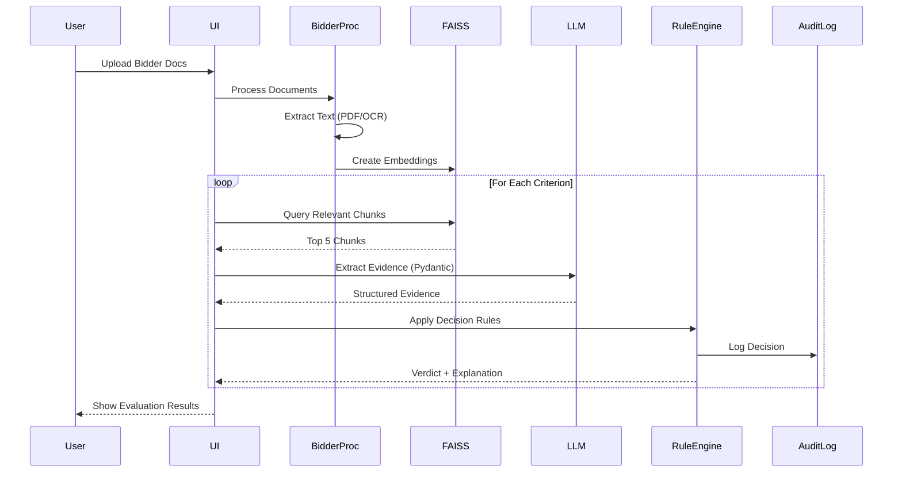

# Design Document: Pramana AI Tender Evaluator

## Overview

Pramana AI is a local-first, evidence-grounded tender evaluation system that processes government procurement documents and evaluates bidder submissions against eligibility criteria. The system architecture follows a strict separation principle: **AI extracts, Python decides**. Local LLMs (Llama 3.1 via Ollama) extract structured information from documents, while deterministic Python rule engines make all final eligibility decisions.

The system is designed for hackathon demonstration on resource-constrained hardware (16GB RAM Windows laptop) with aggressive caching and optimization strategies to achieve sub-60-second tender processing and sub-90-second bidder evaluation.

### Key Design Principles

1. **Local-Only Execution**: All processing runs offline using Ollama, no cloud dependencies
2. **Deterministic Decision Making**: LLMs extract evidence, Python rules make decisions
3. **Crash Prevention**: Pydantic validation for all LLM outputs with retry logic
4. **Full Auditability**: Every decision traces back to source documents with page numbers
5. **Performance Optimization**: Aggressive caching, pre-computed embeddings, Streamlit session state

## Architecture

### High-Level System Architecture



### Data Flow: Tender Processing



### Data Flow: Bidder Evaluation



## Components and Interfaces

### 1. Tender Processor Module

**Responsibility**: Extract eligibility criteria from tender documents

**Key Classes**:
- `TenderProcessor`: Orchestrates tender document processing
- `TextExtractor`: Handles PDF text extraction (pdfplumber)
- `TableExtractor`: Handles table extraction (camelot-py)
- `CriteriaExtractor`: LLM-based structured extraction

**Interface**:
```python
class TenderProcessor:
    def process_tender(self, pdf_path: str) -> TenderDocument:
        """Extract criteria from tender PDF"""
        
    def extract_text_and_tables(self, pdf_path: str) -> RawContent:
        """Extract raw content using pdfplumber and camelot"""
        
    def extract_criteria(self, raw_content: RawContent) -> List[EligibilityCriterion]:
        """Use LLM to extract structured criteria"""
```

### 2. Bidder Document Processor Module

**Responsibility**: Ingest and process bidder submission documents

**Key Classes**:
- `BidderDocumentProcessor`: Orchestrates bidder document processing
- `OCREngine`: Handles scanned document text extraction (Tesseract)
- `DocumentParser`: Routes to appropriate extraction method
- `EmbeddingGenerator`: Creates vector embeddings

**Interface**:
```python
class BidderDocumentProcessor:
    def process_submission(self, file_paths: List[str], bidder_id: str) -> BidderSubmission:
        """Process all documents for a bidder"""
        
    def extract_text(self, file_path: str) -> ExtractedDocument:
        """Extract text from PDF or image"""
        
    def generate_embeddings(self, documents: List[ExtractedDocument]) -> None:
        """Create and store FAISS embeddings"""
```

### 3. Evaluation Engine Module

**Responsibility**: Evaluate bidders against criteria using evidence retrieval

**Key Classes**:
- `EvaluationEngine`: Orchestrates criterion-by-criterion evaluation
- `RetrievalEngine`: FAISS-based semantic search
- `EvidenceExtractor`: LLM-based evidence extraction with Pydantic validation
- `ConfidenceCalculator`: Computes confidence scores

**Interface**:
```python
class EvaluationEngine:
    def evaluate_bidder(self, bidder: BidderSubmission, criteria: List[EligibilityCriterion]) -> EvaluationResult:
        """Evaluate bidder against all criteria"""
        
    def evaluate_criterion(self, criterion: EligibilityCriterion, bidder: BidderSubmission) -> CriterionEvaluation:
        """Evaluate single criterion"""
        
    def retrieve_evidence(self, criterion: EligibilityCriterion, bidder_id: str) -> List[EvidenceChunk]:
        """Retrieve relevant document chunks from FAISS"""
```

### 4. Rule Engine Module

**Responsibility**: Make deterministic eligibility decisions based on extracted evidence

**Key Classes**:
- `RuleEngine`: Applies decision rules
- `FinancialRuleSet`: Rules for financial criteria
- `TechnicalRuleSet`: Rules for technical criteria
- `ComplianceRuleSet`: Rules for compliance criteria
- `DocumentationRuleSet`: Rules for documentation criteria

**Interface**:
```python
class RuleEngine:
    def apply_rules(self, criterion: EligibilityCriterion, evidence: Evidence) -> Decision:
        """Apply deterministic rules to make decision"""
        
    def compute_verdict(self, evaluations: List[CriterionEvaluation]) -> Verdict:
        """Compute final verdict from criterion evaluations"""
        
    def log_decision(self, decision: Decision) -> None:
        """Log decision to audit trail"""
```

### 5. LLM Extractor Module

**Responsibility**: Interface with Ollama for structured information extraction

**Key Classes**:
- `LLMExtractor`: Manages LLM interactions with retry logic
- `PromptBuilder`: Constructs extraction prompts
- `ValidationHandler`: Handles Pydantic validation failures

**Interface**:
```python
class LLMExtractor:
    def extract_structured(self, text: str, schema: Type[BaseModel], max_retries: int = 3) -> BaseModel:
        """Extract structured data with Pydantic validation"""
        
    def extract_criteria(self, tender_text: str) -> CriteriaList:
        """Extract eligibility criteria from tender"""
        
    def extract_evidence(self, chunks: List[str], criterion: EligibilityCriterion) -> Evidence:
        """Extract evidence for specific criterion"""
```

### 6. Human Review Dashboard Module

**Responsibility**: Provide interface for manual review and override

**Key Classes**:
- `ReviewDashboard`: Streamlit UI for review
- `OverrideManager`: Handles manual overrides
- `ExplainabilityViewer`: Displays evidence and decisions

**Interface**:
```python
class ReviewDashboard:
    def display_flagged_evaluations(self, evaluations: List[EvaluationResult]) -> None:
        """Show evaluations needing review"""
        
    def display_evidence(self, criterion_eval: CriterionEvaluation) -> None:
        """Show evidence with source documents"""
        
    def apply_override(self, criterion_id: str, new_result: str, justification: str) -> None:
        """Apply manual override"""
```

### 7. Report Generator Module

**Responsibility**: Generate downloadable PDF evaluation reports

**Key Classes**:
- `ReportGenerator`: Creates PDF reports
- `ReportFormatter`: Formats content for government compliance
- `AuditTrailFormatter`: Formats audit information

**Interface**:
```python
class ReportGenerator:
    def generate_report(self, evaluation: EvaluationResult) -> bytes:
        """Generate PDF report"""
        
    def format_explainability_record(self, criterion_eval: CriterionEvaluation) -> str:
        """Format explainability information"""
```

## Data Models

### Core Pydantic Schemas

```python
from pydantic import BaseModel, Field, validator
from typing import List, Literal, Optional
from datetime import datetime

class EligibilityCriterion(BaseModel):
    """Extracted eligibility criterion from tender"""
    id: str = Field(description="Unique criterion identifier")
    category: Literal["Financial", "Technical", "Compliance", "Documentation"]
    priority: Literal["Mandatory", "Optional"]
    description: str = Field(description="Full criterion text")
    threshold_value: Optional[str] = Field(None, description="Numeric threshold if applicable")
    threshold_unit: Optional[str] = Field(None, description="Unit for threshold")
    source_page: int = Field(description="Page number in tender document")
    original_text: str = Field(description="Original text from document")

class ExtractedDocument(BaseModel):
    """Processed bidder document"""
    document_id: str
    bidder_id: str
    file_name: str
    pages: List[str] = Field(description="Text content per page")
    page_metadata: List[dict] = Field(description="Metadata per page")
    ocr_confidence: Optional[float] = Field(None, description="Average OCR confidence")
    extraction_method: Literal["pdfplumber", "tesseract"]

class EvidenceChunk(BaseModel):
    """Retrieved evidence chunk from FAISS"""
    text: str = Field(description="Extracted text chunk")
    document_id: str
    page_number: int
    confidence: float = Field(ge=0.0, le=1.0, description="Retrieval confidence")
    source_file: str

class FinancialEvidence(BaseModel):
    """Extracted financial evidence"""
    value: float = Field(description="Numeric value")
    currency: str = Field(description="Currency code")
    unit: Optional[str] = Field(None, description="Unit if applicable")
    context: str = Field(description="Surrounding context")
    source_page: int
    confidence: float = Field(ge=0.0, le=1.0)

class TechnicalEvidence(BaseModel):
    """Extracted technical evidence"""
    specification: str = Field(description="Technical specification")
    certifications: List[str] = Field(default_factory=list)
    capabilities: List[str] = Field(default_factory=list)
    source_page: int
    confidence: float = Field(ge=0.0, le=1.0)

class ComplianceEvidence(BaseModel):
    """Extracted compliance evidence"""
    regulation: str = Field(description="Regulation or standard")
    compliance_status: str = Field(description="Compliance statement")
    effective_date: Optional[str] = Field(None, description="Date if mentioned")
    source_page: int
    confidence: float = Field(ge=0.0, le=1.0)

class DocumentationEvidence(BaseModel):
    """Extracted documentation evidence"""
    document_present: bool = Field(description="Whether document exists")
    document_type: str = Field(description="Type of document")
    completeness: str = Field(description="Completeness assessment")
    source_page: int
    confidence: float = Field(ge=0.0, le=1.0)

class Decision(BaseModel):
    """Rule engine decision"""
    criterion_id: str
    verdict: Literal["Satisfied", "Not Satisfied", "Needs Review"]
    rule_applied: str = Field(description="Name of rule that made decision")
    comparison: Optional[str] = Field(None, description="Threshold comparison details")
    rationale: str = Field(description="Human-readable explanation")
    timestamp: datetime

class CriterionEvaluation(BaseModel):
    """Complete evaluation of single criterion"""
    criterion: EligibilityCriterion
    evidence_chunks: List[EvidenceChunk]
    extracted_evidence: BaseModel = Field(description="Type-specific evidence")
    decision: Decision
    explainability_record: dict = Field(description="Full audit trail")

class EvaluationResult(BaseModel):
    """Complete bidder evaluation result"""
    bidder_id: str
    bidder_name: str
    final_verdict: Literal["Eligible", "Not Eligible", "Needs Review"]
    criterion_evaluations: List[CriterionEvaluation]
    summary: dict = Field(description="Counts of satisfied/failed/reviewed")
    timestamp: datetime
    system_version: str

class ManualOverride(BaseModel):
    """Manual review override"""
    criterion_id: str
    original_verdict: str
    new_verdict: str
    reviewer_id: str
    justification: str
    timestamp: datetime
```

### Database Schema

**FAISS Vector Store**:
- Index: Flat L2 index for simplicity (small dataset for demo)
- Dimension: 384 (all-MiniLM-L6-v2 output dimension)
- Metadata: Stored separately in JSON mapping index → document metadata

**Audit Log Structure** (JSON files):
```json
{
  "evaluation_id": "uuid",
  "bidder_id": "string",
  "timestamp": "iso8601",
  "operations": [
    {
      "operation_type": "criterion_evaluation",
      "criterion_id": "string",
      "evidence_extracted": {},
      "rule_applied": "string",
      "decision": "string",
      "timestamp": "iso8601"
    }
  ],
  "manual_overrides": [],
  "final_verdict": "string"
}
```

**Cache Structure** (Streamlit session state):
```python
st.session_state = {
    "tender_document": TenderDocument,
    "extracted_criteria": List[EligibilityCriterion],
    "bidder_submissions": Dict[str, BidderSubmission],
    "faiss_index": faiss.Index,
    "embedding_metadata": Dict[int, dict],
    "evaluation_results": Dict[str, EvaluationResult],
    "llm_cache": Dict[str, Any]  # Cache LLM responses by prompt hash
}
```


## Caching Strategy for Demo Performance

### Aggressive Caching Layers

1. **LLM Response Cache**:
   - Hash prompts and cache responses in session state
   - Pre-compute tender criteria extraction before demo
   - Store in pickle files for instant loading

2. **Embedding Cache**:
   - Pre-compute all embeddings for demo bidder documents
   - Store FAISS index to disk, load at startup
   - Avoid re-embedding during live demo

3. **Streamlit Session State**:
   - Cache all processed documents in session
   - Cache evaluation results to avoid re-computation
   - Use `@st.cache_data` and `@st.cache_resource` decorators

4. **Document Processing Cache**:
   - Pre-process demo documents, store extracted text
   - Cache OCR results (slowest operation)
   - Load from JSON files during demo

### Performance Targets

| Operation | Target Time | Optimization Strategy |
|-----------|-------------|----------------------|
| Tender Upload | < 5s | Pre-cached extraction |
| Bidder Upload | < 10s | Pre-computed embeddings |
| Single Criterion Eval | < 5s | Cached FAISS queries |
| Full Bidder Eval | < 90s | Parallel processing where possible |
| Report Generation | < 10s | Template-based generation |

## LLM Integration Architecture

### Ollama Configuration

```python
from langchain_community.llms import Ollama
from langchain.output_parsers import PydanticOutputParser
from langchain.prompts import PromptTemplate

class LLMConfig:
    MODEL_NAME = "llama3.1"
    TEMPERATURE = 0.1  # Low temperature for consistency
    MAX_TOKENS = 2048
    TIMEOUT = 30  # seconds
    
class LLMExtractor:
    def __init__(self):
        self.llm = Ollama(
            model=LLMConfig.MODEL_NAME,
            temperature=LLMConfig.TEMPERATURE,
            num_predict=LLMConfig.MAX_TOKENS
        )
        
    def extract_with_validation(
        self, 
        text: str, 
        schema: Type[BaseModel],
        max_retries: int = 3
    ) -> BaseModel:
        """Extract structured data with retry logic"""
        parser = PydanticOutputParser(pydantic_object=schema)
        
        prompt = PromptTemplate(
            template="Extract information from the following text.\n{format_instructions}\n\nText: {text}\n",
            input_variables=["text"],
            partial_variables={"format_instructions": parser.get_format_instructions()}
        )
        
        for attempt in range(max_retries):
            try:
                chain = prompt | self.llm | parser
                result = chain.invoke({"text": text})
                return result
            except ValidationError as e:
                if attempt == max_retries - 1:
                    # Return safe default
                    return self._get_safe_default(schema)
                # Retry with simplified prompt
                continue
```

### Prompt Templates

**Criteria Extraction Prompt**:
```
You are extracting eligibility criteria from a government tender document.

Extract all eligibility requirements and classify them.

For each criterion, identify:
- Category: Financial, Technical, Compliance, or Documentation
- Priority: Mandatory or Optional
- Description: Full text of the requirement
- Threshold: Any numeric threshold mentioned
- Page number where it appears

Text:
{tender_text}

{format_instructions}
```

**Evidence Extraction Prompt** (Financial):
```
You are extracting financial evidence from bidder documents.

Criterion: {criterion_description}

Find evidence related to this criterion in the following text chunks.

Extract:
- Numeric value
- Currency
- Unit (if applicable)
- Context (surrounding text)
- Page number

Text chunks:
{chunks}

{format_instructions}
```

## Retrieval Architecture

### FAISS Configuration

```python
import faiss
from sentence_transformers import SentenceTransformer

class RetrievalEngine:
    def __init__(self):
        self.embedding_model = SentenceTransformer('all-MiniLM-L6-v2')
        self.dimension = 384
        self.index = faiss.IndexFlatL2(self.dimension)
        self.metadata = {}  # Maps index → document metadata
        
    def add_documents(self, documents: List[ExtractedDocument]):
        """Add documents to FAISS index"""
        for doc in documents:
            for page_num, page_text in enumerate(doc.pages):
                # Chunk page into smaller pieces
                chunks = self._chunk_text(page_text, chunk_size=512)
                for chunk in chunks:
                    embedding = self.embedding_model.encode([chunk])[0]
                    idx = self.index.ntotal
                    self.index.add(embedding.reshape(1, -1))
                    self.metadata[idx] = {
                        "document_id": doc.document_id,
                        "page_number": page_num + 1,
                        "text": chunk,
                        "source_file": doc.file_name
                    }
    
    def retrieve(self, query: str, top_k: int = 5) -> List[EvidenceChunk]:
        """Retrieve top-k relevant chunks"""
        query_embedding = self.embedding_model.encode([query])[0]
        distances, indices = self.index.search(
            query_embedding.reshape(1, -1), 
            top_k
        )
        
        chunks = []
        for dist, idx in zip(distances[0], indices[0]):
            meta = self.metadata[idx]
            confidence = 1.0 / (1.0 + dist)  # Convert distance to confidence
            chunks.append(EvidenceChunk(
                text=meta["text"],
                document_id=meta["document_id"],
                page_number=meta["page_number"],
                confidence=confidence,
                source_file=meta["source_file"]
            ))
        
        return chunks
    
    def _chunk_text(self, text: str, chunk_size: int = 512) -> List[str]:
        """Split text into overlapping chunks"""
        words = text.split()
        chunks = []
        for i in range(0, len(words), chunk_size // 2):  # 50% overlap
            chunk = " ".join(words[i:i + chunk_size])
            chunks.append(chunk)
        return chunks
```

### Chunking Strategy

- Chunk size: 512 tokens (balance between context and precision)
- Overlap: 50% (256 tokens) to avoid splitting relevant information
- Metadata preservation: Track source document and page for every chunk


## Correctness Properties

*A property is a characteristic or behavior that should hold true across all valid executions of a system—essentially, a formal statement about what the system should do. Properties serve as the bridge between human-readable specifications and machine-verifiable correctness guarantees.*

### Property 1: Text Extraction Preserves Content

*For any* PDF document with text content, extracting text using pdfplumber and then comparing it to the original should preserve all textual information without loss.

**Validates: Requirements 1.1**

### Property 2: Table Structure Preservation

*For any* PDF containing tables, extracting tables using camelot-py should preserve the table structure (rows, columns, cell values) accurately.

**Validates: Requirements 1.2**

### Property 3: Criteria Extraction Returns Valid Schema

*For any* tender text processed by the LLM_Extractor, the output should be a valid Pydantic CriteriaList object with all required fields populated.

**Validates: Requirements 1.3**

### Property 4: Criterion Category Validity

*For any* extracted eligibility criterion, the category field should be exactly one of: "Financial", "Technical", "Compliance", or "Documentation".

**Validates: Requirements 1.4**

### Property 5: Criterion Priority Validity

*For any* extracted eligibility criterion, the priority field should be exactly one of: "Mandatory" or "Optional".

**Validates: Requirements 1.5**

### Property 6: Metadata Completeness

*For any* extracted data (criteria, documents, evidence), the output should include complete source metadata: original text, page numbers, and document references.

**Validates: Requirements 1.6, 2.4, 3.5**

### Property 7: Extraction Failure Handling

*For any* extraction operation that fails, the system should return a flag for manual review rather than partial or incomplete data.

**Validates: Requirements 1.7**

### Property 8: File Type Acceptance

*For any* file with extension .pdf, .png, .jpg, or .jpeg, the Document_Uploader should accept it; for any other extension, it should reject it.

**Validates: Requirements 2.1**

### Property 9: OCR for Image Files

*For any* uploaded image file (PNG, JPG, JPEG) or scanned PDF, the system should use Tesseract OCR for text extraction.

**Validates: Requirements 2.2**

### Property 10: PDFPlumber for Native PDFs

*For any* native PDF file, the system should use pdfplumber for text extraction, not OCR.

**Validates: Requirements 2.3**

### Property 11: Multi-Document Aggregation

*For any* list of documents uploaded for a single bidder, they should all be grouped under the same bidder_id in the submission package.

**Validates: Requirements 2.5**

### Property 12: OCR Confidence Flagging

*For any* page processed with OCR, if the confidence score is below 0.6, the page should be flagged for manual verification; if confidence is >= 0.6, no flag should be set.

**Validates: Requirements 2.6**

### Property 13: Structured Document Storage

*For any* processed document, the stored output should be a valid ExtractedDocument Pydantic object with structured text and source references.

**Validates: Requirements 2.7**

### Property 14: Embedding Dimension Consistency

*For any* text embedded using all-MiniLM-L6-v2, the resulting vector should have dimension 384.

**Validates: Requirements 3.1**

### Property 15: FAISS Index Growth

*For any* set of documents added to FAISS, the index size (ntotal) should increase by the number of chunks added.

**Validates: Requirements 3.2**

### Property 16: Top-K Retrieval

*For any* criterion query to FAISS, the system should return exactly 5 chunks (or fewer if less than 5 chunks exist in the index).

**Validates: Requirements 3.3**

### Property 17: Evidence Schema Validation

*For any* evidence extracted by LLM_Extractor, the output should be a valid Pydantic evidence object (FinancialEvidence, TechnicalEvidence, ComplianceEvidence, or DocumentationEvidence) with all required fields.

**Validates: Requirements 3.4**

### Property 18: Low Confidence Evidence Flagging

*For any* criterion evaluation where all retrieved evidence has confidence <= 0.5, the system should mark the criterion as "Evidence Not Found".

**Validates: Requirements 3.6**

### Property 19: Embedding Cache Reuse

*For any* document that has been embedded once, subsequent embedding requests should return cached results without recomputation.

**Validates: Requirements 3.7, 8.7**

### Property 20: Criterion Independence

*For any* two criteria A and B, evaluating criterion A should not affect the evaluation result of criterion B (independence).

**Validates: Requirements 4.1**

### Property 21: Type-Specific Evidence Schema Completeness

*For any* criterion of type Financial, the extracted evidence should have fields: value, currency, unit; for Technical: specification, certifications, capabilities; for Compliance: regulation, compliance_status, effective_date; for Documentation: document_present, document_type, completeness.

**Validates: Requirements 4.2, 4.3, 4.4, 4.5**

### Property 22: Explainability Record Completeness

*For any* criterion evaluation, the explainability record should contain: evidence text, source page, extracted values, confidence score, and decision rationale with traceability to source documents.

**Validates: Requirements 4.6, 10.2, 10.7**

### Property 23: Pydantic Validation Prevents Crashes

*For any* LLM output that fails Pydantic validation, the system should catch the validation error and return a safe default value without crashing.

**Validates: Requirements 4.7**

### Property 24: Rule Engine Determinism

*For any* criterion with the same evidence, the Rule_Engine should always return the same decision (deterministic behavior).

**Validates: Requirements 5.1**

### Property 25: LLM Extraction Scope Limitation

*For any* LLM extraction output schema, it should contain only evidence fields (values, text, metadata) and no decision fields (verdicts, pass/fail).

**Validates: Requirements 5.2**

### Property 26: Mandatory Criterion Threshold Comparison

*For any* mandatory criterion with extracted evidence, the Rule_Engine should perform a threshold comparison and log the comparison details.

**Validates: Requirements 5.3**

### Property 27: Low Confidence Triggers Review

*For any* mandatory criterion with evidence confidence < 0.7, the Rule_Engine should assign verdict "Needs Review".

**Validates: Requirements 5.4**

### Property 28: All Satisfied Means Eligible

*For any* bidder evaluation where all mandatory criteria have verdict "Satisfied", the final verdict should be "Eligible".

**Validates: Requirements 5.5**

### Property 29: Any Failed Means Not Eligible

*For any* bidder evaluation where at least one mandatory criterion has verdict "Not Satisfied", the final verdict should be "Not Eligible".

**Validates: Requirements 5.6**

### Property 30: Comprehensive Audit Logging

*For any* decision made by the Rule_Engine, the audit log should contain: timestamp, criterion_id, rule_applied, values_compared, and decision rationale.

**Validates: Requirements 5.7, 10.1, 10.6**

### Property 31: Review Dashboard Filtering

*For any* set of bidder evaluations, the Human_Review_Dashboard should display exactly those bidders with final verdict "Needs Review" and no others.

**Validates: Requirements 6.1**

### Property 32: Flagged Criterion Explainability Display

*For any* flagged criterion in the review dashboard, the displayed information should include the complete explainability record with all fields.

**Validates: Requirements 6.2**

### Property 33: Manual Override Functionality

*For any* criterion evaluation, the override function should accept a new verdict and update the evaluation accordingly.

**Validates: Requirements 6.4**

### Property 34: Override Audit Trail

*For any* manual override applied, the system should create a ManualOverride object containing: reviewer_id, timestamp, justification, original_verdict, and new_verdict.

**Validates: Requirements 6.5**

### Property 35: Verdict Recomputation After Override

*For any* bidder evaluation where a criterion evaluation is manually modified, the final verdict should be automatically recalculated based on the updated criterion results.

**Validates: Requirements 6.7**

### Property 36: PDF Report Generation

*For any* bidder evaluation, the Report_Generator should produce a valid PDF file (bytes that can be parsed as a PDF document).

**Validates: Requirements 7.1**

### Property 37: Report Completeness

*For any* generated evaluation report, it should include: bidder name, final verdict, evaluation timestamp, system version, all criteria with results and evidence, page references for all evidence, manual overrides with reviewer details, and summary counts of satisfied/failed/reviewed criteria.

**Validates: Requirements 7.2, 7.3, 7.4, 7.5, 7.6**

### Property 38: Local-Only Execution

*For any* system operation, no external API calls or network requests should be made (all processing is local).

**Validates: Requirements 8.1, 8.2**

### Property 39: Cache Utilization

*For any* operation that uses Streamlit caching decorators, subsequent calls with the same inputs should return cached results (cache hits).

**Validates: Requirements 8.4**

### Property 40: Tender Processing Performance

*For any* tender document, the processing time from upload to extracted criteria should be <= 60 seconds.

**Validates: Requirements 8.5**

### Property 41: Bidder Evaluation Performance

*For any* bidder submission, the evaluation time for all criteria should be <= 90 seconds.

**Validates: Requirements 8.6**

### Property 42: Pydantic Type Safety Infrastructure

*For any* LLM extraction function, it should use Pydantic schemas with type constraints, and all data passed to UI should be validated Pydantic objects.

**Validates: Requirements 9.1, 9.2, 9.5, 9.7**

### Property 43: Validation Failure Retry Logic

*For any* LLM output that fails Pydantic validation, the system should retry extraction with a simplified prompt (up to 3 attempts).

**Validates: Requirements 9.3**

### Property 44: Retry Exhaustion Fallback

*For any* extraction that fails validation after 3 retry attempts, the system should return a safe default value and flag the criterion for manual review.

**Validates: Requirements 9.4**

### Property 45: Validation Failure Logging

*For any* Pydantic validation failure, the system should log the malformed output for debugging purposes.

**Validates: Requirements 9.6**

### Property 46: AI vs Rule Distinction

*For any* system output (dashboard, report), it should clearly distinguish between AI-extracted evidence and rule-based decisions through labeling or structure.

**Validates: Requirements 10.4**

### Property 47: Original Document Preservation

*For any* extracted evidence, the original document page content should be preserved and accessible for verification.

**Validates: Requirements 10.5**

### Property 48: Confidence Score Display

*For any* AI-extracted information displayed in the UI, it should include the associated confidence score.

**Validates: Requirements 10.3**


## Error Handling

### Error Categories and Strategies

#### 1. Document Processing Errors

**PDF Extraction Failures**:
- Error: pdfplumber fails to extract text from corrupted PDF
- Handling: Catch exception, flag document for manual review, log error details
- User feedback: "Document could not be processed. Please verify file integrity."

**OCR Failures**:
- Error: Tesseract fails on low-quality scanned images
- Handling: Return low confidence score, flag page for manual review
- User feedback: "Low quality scan detected on page X. Manual verification recommended."

**Table Extraction Failures**:
- Error: camelot-py cannot detect tables in PDF
- Handling: Fall back to text extraction only, log warning
- User feedback: "Tables detected but could not be extracted. Please verify manually."

#### 2. LLM Extraction Errors

**Pydantic Validation Failures**:
- Error: LLM returns malformed JSON or missing required fields
- Handling: Retry with simplified prompt (max 3 attempts), then return safe default
- Safe defaults:
  - Criteria extraction: Empty list with manual review flag
  - Evidence extraction: Evidence object with confidence=0.0 and "Evidence Not Found" flag
- Logging: Log malformed output for debugging

**Ollama Connection Failures**:
- Error: Ollama service not running or model not loaded
- Handling: Catch connection error, display clear error message, prevent system crash
- User feedback: "AI service unavailable. Please ensure Ollama is running with Llama 3.1 model."

**Timeout Errors**:
- Error: LLM takes > 30 seconds to respond
- Handling: Timeout request, retry once, then flag for manual processing
- User feedback: "Processing timeout. Please try again or process manually."

#### 3. Vector Database Errors

**FAISS Index Errors**:
- Error: FAISS index corrupted or not initiali